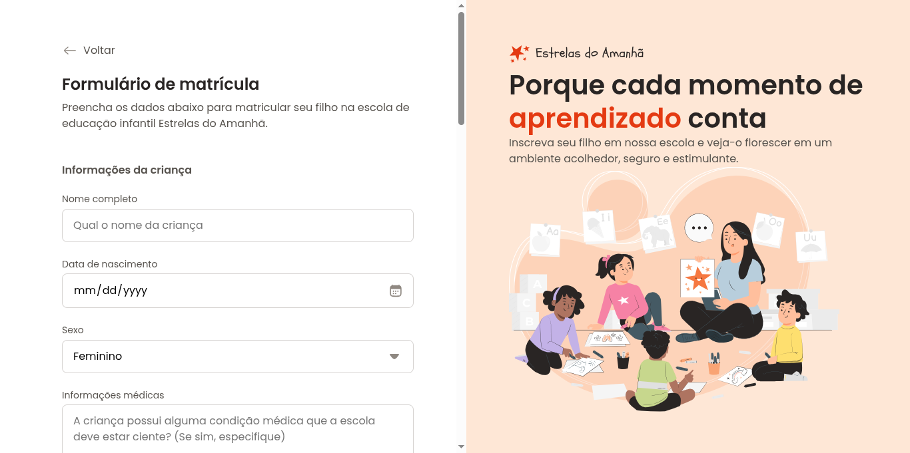

# Boas-vindas ao projeto Formuláro de Matrícula

> Projeto prático da Rocketseat formação FullStack

representação da minha versão do projeto

[🔗Clique aqui para acessar](https://atilacsilva.github.io/registration-form)

## 🔥Sobre o projeto!

Nesse projeto foi criado o layout de uma página de matrícula de uma escola chamada Estrelas do Amanhã.
Esse é um dos projetos desenvolvidos em aula na formação Full-stack, um dos conteúdos de especialização.

## 🛠️ Tecnologias!

- HTML5
- CSS

### ✍️ O que Aprendi!!

Aprendi muito de CSS, além de por em prática quase todos os conceitos aprendidos na unidade, e várias estratégias de estilização além de alguns pequenos hackers também.
